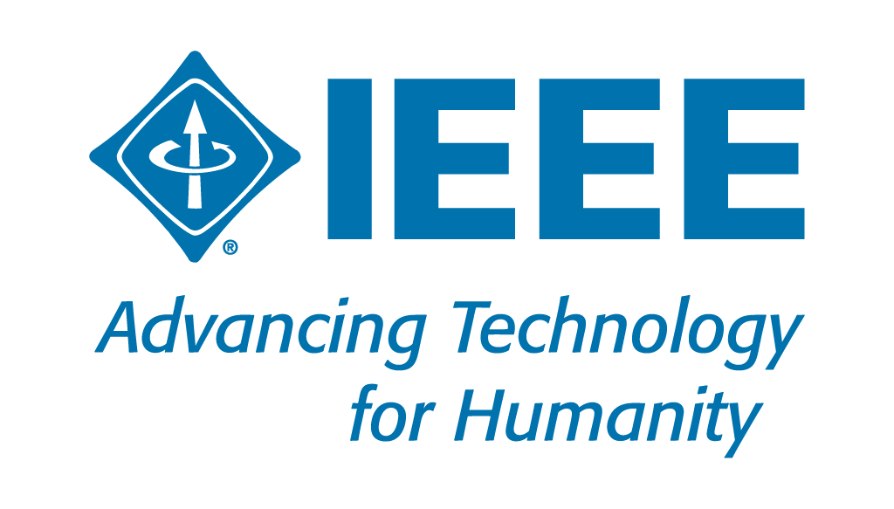
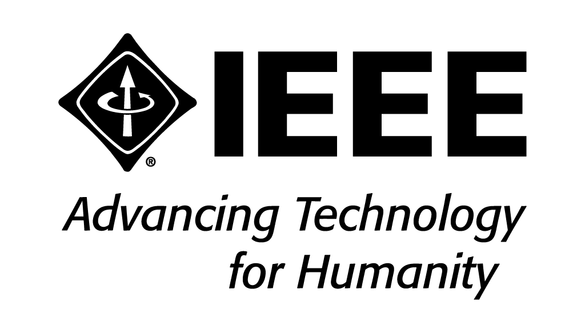
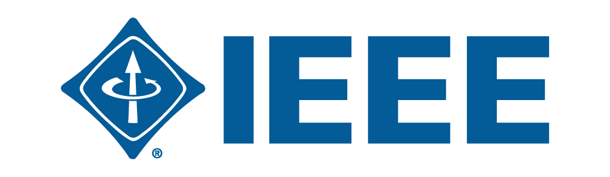
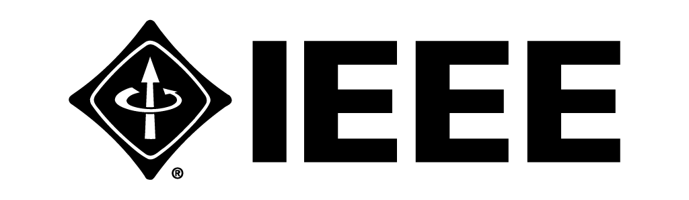
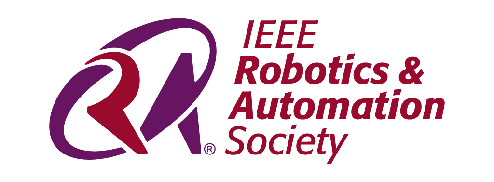
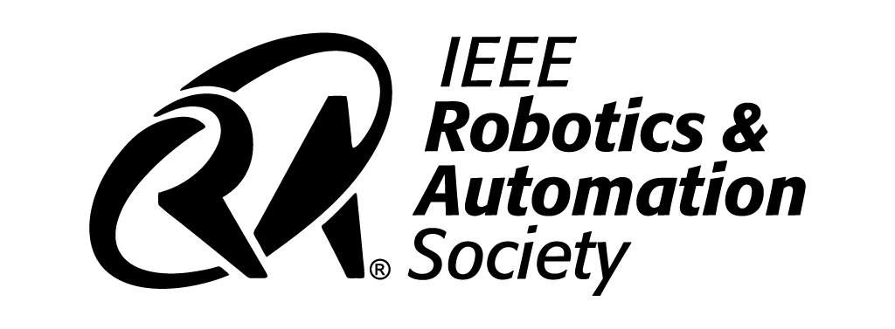
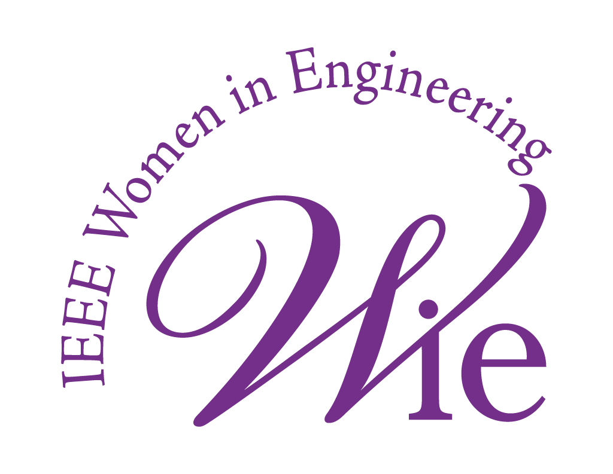
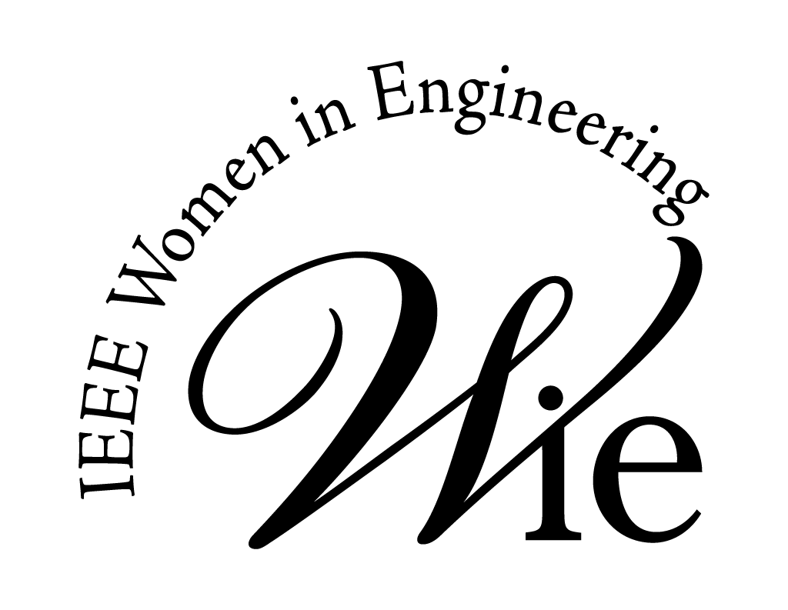
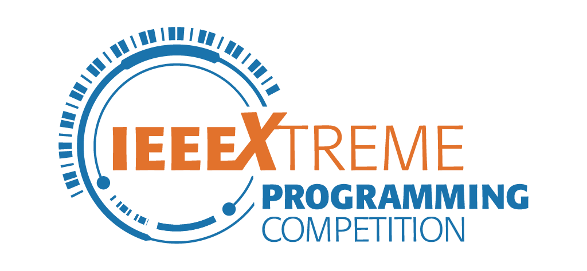
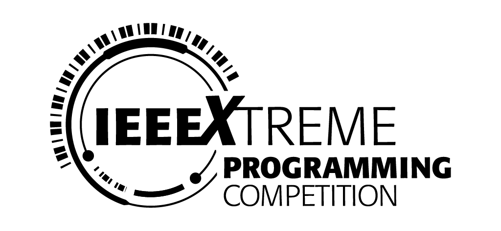

# IEEE UACh

Este repositorio fue creado con el propósito almacenar archivos y recursos gráficos relacionados con la **Rama Estudiantil IEEE de la Universidad Austral de Chile**.  

Página web: https://studentbranches.ieee.org/cl-uach/

---
## Guidelines

Antes de utilizar los logos vinculados a la IEEE, se recomienda leer los siguiente documentos.

* **General**:

	* <a href="https://raw.githubusercontent.com/aretesatori/IEEE-UACh/main/Guidelines/IEEE-Brand-Identity-Guidelines_2025.pdf">IEEE Brand Identity Guidelines (2025)</a> | (**Actualizado**) Proporciona información acerca de la organización IEEE, directrices de uso de la marca corporativa, y contiene un manual de estilo gráfico detallado.

	* <a href="https://raw.githubusercontent.com/aretesatori/IEEE-UACh/main/Guidelines/IEEE-Geographic-Communities-Identity-Guidelines.pdf">IEEE Geographic Communities Identity Guidelines</a> | Proporciona las directrices existentes para Regiones, Secciones, Capítulos Técnicos, Ramas y Capítulos de Estudiantes, y Grupos de Afinidad.

	* <a href="https://raw.githubusercontent.com/aretesatori/IEEE-UACh/main/Guidelines/IEEE-Color-Guide.pdf">IEEE Color Guide</a> | Contiene la paleta de colores oficial de la IEEE.

* **Capítulos**:

	* <a href="https://raw.githubusercontent.com/aretesatori/IEEE-UACh/main/Guidelines/IEEE_RAS_Logo-Guidelines.pdf">IEEE Robotics & Automation Society Logo Guidelines</a> | Proporciona información importante acerca del uso correcto del logo del capítulo estudiantil RA.

	* <a href="https://raw.githubusercontent.com/aretesatori/IEEE-UACh/main/Guidelines/IEEE_EMBS-Visual-Identity-Guidelines.pdf">IEEE Engineering Medicine and Biology Society Visual Identity Guidelines</a> | Proporciona información importante acerca del uso correcto del logo del capítulo estudiantil EMB.

* **Grupo de Afinidad**:

	* <a href="https://raw.githubusercontent.com/aretesatori/IEEE-UACh/main/Guidelines/IEEE_WIE_Brand-Guidelines.pdf">IEEE Women in Engineering Identity Guidelines</a> | Proporciona información importante acerca del uso correcto del logo del grupo de afinidad WIE.

---
## Logos UACh

Los logos propios de la *Facultad de Ciencias de la Ingeniería*, de la *Universidad Austral de Chile* y de la carrera de *Ingeniería Civil Electrónica* pueden ser encontrados en el siguiente repositorio:

Link: https://github.com/aretesatori/Logos-UACh

---
## Logos Oficiales

### IEEE

	

* <a href="https://raw.githubusercontent.com/aretesatori/IEEE-UACh/main/Logos/IEEE/SVG/Logo-IEEE-Color.svg">**Descargar SVG**</a>  

* <a href="https://raw.githubusercontent.com/aretesatori/IEEE-UACh/main/Logos/IEEE/PDF/Logo-IEEE-Color.pdf">**Descargar PDF**</a>  

* <a href="https://raw.githubusercontent.com/aretesatori/IEEE-UACh/main/Logos/IEEE/1024w/Logo-IEEE-Color_1024x583.png">**Descargar PNG**</a> (1024 x 583 px)  

* <a href="https://raw.githubusercontent.com/aretesatori/IEEE-UACh/main/Logos/IEEE/2048w/Logo-IEEE-Color_2048x1166.png">**Descargar PNG**</a> (2048 x 1166 px)  

---

	

* <a href="https://raw.githubusercontent.com/aretesatori/IEEE-UACh/main/Logos/IEEE/SVG/Logo-IEEE-Black.svg">**Descargar SVG**</a>  

* <a href="https://raw.githubusercontent.com/aretesatori/IEEE-UACh/main/Logos/IEEE/PDF/Logo-IEEE-Black.pdf">**Descargar PDF**</a>  

* <a href="https://raw.githubusercontent.com/aretesatori/IEEE-UACh/main/Logos/IEEE/1024w/Logo-IEEE-Black_1024x583.png">**Descargar PNG**</a> (1024 x 583 px)  

* <a href="https://raw.githubusercontent.com/aretesatori/IEEE-UACh/main/Logos/IEEE/2048w/Logo-IEEE-Black_2048x1166.png">**Descargar PNG**</a> (2048 x 1166 px)  

---

	

* <a href="https://raw.githubusercontent.com/aretesatori/IEEE-UACh/main/Logos/IEEE/SVG/Logo-IEEE-White.svg">**Descargar SVG**</a>  

* <a href="https://raw.githubusercontent.com/aretesatori/IEEE-UACh/main/Logos/IEEE/PDF/Logo-IEEE-White.pdf">**Descargar PDF**</a>  

* <a href="https://raw.githubusercontent.com/aretesatori/IEEE-UACh/main/Logos/IEEE/1024w/Logo-IEEE-White_1024x583.png">**Descargar PNG**</a> (1024 x 583 px)  

* <a href="https://raw.githubusercontent.com/aretesatori/IEEE-UACh/main/Logos/IEEE/2048w/Logo-IEEE-White_2048x1166.png">**Descargar PNG**</a> (2048 x 1166 px)  

---

	

* <a href="https://raw.githubusercontent.com/aretesatori/IEEE-UACh/main/Logos/IEEE/SVG/Logo-IEEE-Small-Color.svg">**Descargar SVG**</a>  

* <a href="https://raw.githubusercontent.com/aretesatori/IEEE-UACh/main/Logos/IEEE/PDF/Logo-IEEE-Small-Color.pdf">**Descargar PDF**</a>  

* <a href="https://raw.githubusercontent.com/aretesatori/IEEE-UACh/main/Logos/IEEE/1024w/Logo-IEEE-Small-Color_1024x299.png">**Descargar PNG**</a> (1024 x 299 px)  

* <a href="https://raw.githubusercontent.com/aretesatori/IEEE-UACh/main/Logos/IEEE/2048w/Logo-IEEE-Small-Color_2048x597.png">**Descargar PNG**</a> (2048 x 597 px)  

---

	

* <a href="https://raw.githubusercontent.com/aretesatori/IEEE-UACh/main/Logos/IEEE/SVG/Logo-IEEE-Small-Black.svg">**Descargar SVG**</a>  

* <a href="https://raw.githubusercontent.com/aretesatori/IEEE-UACh/main/Logos/IEEE/PDF/Logo-IEEE-Small-Black.pdf">**Descargar PDF**</a>  

* <a href="https://raw.githubusercontent.com/aretesatori/IEEE-UACh/main/Logos/IEEE/1024w/Logo-IEEE-Small-Black_1024x299.png">**Descargar PNG**</a> (1024 x 299 px)  

* <a href="https://raw.githubusercontent.com/aretesatori/IEEE-UACh/main/Logos/IEEE/2048w/Logo-IEEE-Small-Black_2048x597.png">**Descargar PNG**</a> (2048 x 597 px)  

---

	

* <a href="https://raw.githubusercontent.com/aretesatori/IEEE-UACh/main/Logos/IEEE/SVG/Logo-IEEE-Small-White.svg">**Descargar SVG**</a>  

* <a href="https://raw.githubusercontent.com/aretesatori/IEEE-UACh/main/Logos/IEEE/PDF/Logo-IEEE-Small-White.pdf">**Descargar PDF**</a>  

* <a href="https://raw.githubusercontent.com/aretesatori/IEEE-UACh/main/Logos/IEEE/1024w/Logo-IEEE-Small-White_1024x299.png">**Descargar PNG**</a> (1024 x 299 px)  

* <a href="https://raw.githubusercontent.com/aretesatori/IEEE-UACh/main/Logos/IEEE/2048w/Logo-IEEE-Small-White_2048x597.png">**Descargar PNG**</a> (2048 x 597 px)  

---
### IEEE Robotics and Automation Society (RAS)

	

* <a href="https://raw.githubusercontent.com/aretesatori/IEEE-UACh/main/Logos/IEEE-Robotics-and-Automation-Society/SVG/Logo-IEEE-RAS-Color.svg">**Descargar SVG**</a>  

* <a href="https://raw.githubusercontent.com/aretesatori/IEEE-UACh/main/Logos/IEEE-Robotics-and-Automation-Society/PDF/Logo-IEEE-RAS-Color.pdf">**Descargar PDF**</a>  

* <a href="https://raw.githubusercontent.com/aretesatori/IEEE-UACh/main/Logos/IEEE-Robotics-and-Automation-Society/1024w/Logo-IEEE-RAS-Color_1024x377.png">**Descargar PNG**</a> (1024 x 377 px)  

* <a href="https://raw.githubusercontent.com/aretesatori/IEEE-UACh/main/Logos/IEEE-Robotics-and-Automation-Society/2048w/Logo-IEEE-RAS-Color_2048x574.png">**Descargar PNG**</a> (2048 x 574 px)  

---

	

* <a href="https://raw.githubusercontent.com/aretesatori/IEEE-UACh/main/Logos/IEEE-Robotics-and-Automation-Society/SVG/Logo-IEEE-RAS-Black.svg">**Descargar SVG**</a>  

* <a href="https://raw.githubusercontent.com/aretesatori/IEEE-UACh/main/Logos/IEEE-Robotics-and-Automation-Society/PDF/Logo-IEEE-RAS-Black.pdf">**Descargar PDF**</a>  

* <a href="https://raw.githubusercontent.com/aretesatori/IEEE-UACh/main/Logos/IEEE-Robotics-and-Automation-Society/1024w/Logo-IEEE-RAS-Black_1024x377.png">**Descargar PNG**</a> (1024 x 377 px)  

* <a href="https://raw.githubusercontent.com/aretesatori/IEEE-UACh/main/Logos/IEEE-Robotics-and-Automation-Society/2048w/Logo-IEEE-RAS-Black_2048x574.png">**Descargar PNG**</a> (2048 x 574 px)  

---

	

* <a href="https://raw.githubusercontent.com/aretesatori/IEEE-UACh/main/Logos/IEEE-Robotics-and-Automation-Society/SVG/Logo-IEEE-RAS-White.svg">**Descargar SVG**</a>  

* <a href="https://raw.githubusercontent.com/aretesatori/IEEE-UACh/main/Logos/IEEE-Robotics-and-Automation-Society/PDF/Logo-IEEE-RAS-White.pdf">**Descargar PDF**</a>  

* <a href="https://raw.githubusercontent.com/aretesatori/IEEE-UACh/main/Logos/IEEE-Robotics-and-Automation-Society/1024w/Logo-IEEE-RAS-White_1024x377.png">**Descargar PNG**</a> (1024 x 377 px)  

* <a href="https://raw.githubusercontent.com/aretesatori/IEEE-UACh/main/Logos/IEEE-Robotics-and-Automation-Society/2048w/Logo-IEEE-RAS-White_2048x574.png">**Descargar PNG**</a> (2048 x 574 px)  

---
### IEEE Engineering Medicine and Biology Society (EMBS)

	

* <a href="https://raw.githubusercontent.com/aretesatori/IEEE-UACh/main/Logos/IEEE-Engineering-Medicine-and-Biology-Society/SVG/Logo-IEEE-EMBS-Color.svg">**Descargar SVG**</a>  

* <a href="https://raw.githubusercontent.com/aretesatori/IEEE-UACh/main/Logos/IEEE-Engineering-Medicine-and-Biology-Society/PDF/Logo-IEEE-EMBS-Color.pdf">**Descargar PDF**</a>  

* <a href="https://raw.githubusercontent.com/aretesatori/IEEE-UACh/main/Logos/IEEE-Engineering-Medicine-and-Biology-Society/1024w/Logo-IEEE-EMBS-Color_1024x433.png">**Descargar PNG**</a> (1024 x 433 px)  

* <a href="https://raw.githubusercontent.com/aretesatori/IEEE-UACh/main/Logos/IEEE-Engineering-Medicine-and-Biology-Society/2048w/Logo-IEEE-EMBS-Color_2048x865.png">**Descargar PNG**</a> (2048 x 865 px)  

---

	

* <a href="https://raw.githubusercontent.com/aretesatori/IEEE-UACh/main/Logos/IEEE-Engineering-Medicine-and-Biology-Society/SVG/Logo-IEEE-EMBS-Black.svg">**Descargar SVG**</a>  

* <a href="https://raw.githubusercontent.com/aretesatori/IEEE-UACh/main/Logos/IEEE-Engineering-Medicine-and-Biology-Society/PDF/Logo-IEEE-EMBS-Black.pdf">**Descargar PDF**</a>  

* <a href="https://raw.githubusercontent.com/aretesatori/IEEE-UACh/main/Logos/IEEE-Engineering-Medicine-and-Biology-Society/1024w/Logo-IEEE-EMBS-Black_1024x433.png">**Descargar PNG**</a> (1024 x 433 px)  

* <a href="https://raw.githubusercontent.com/aretesatori/IEEE-UACh/main/Logos/IEEE-Engineering-Medicine-and-Biology-Society/2048w/Logo-IEEE-EMBS-Black_2048x865.png">**Descargar PNG**</a> (2048 x 865 px)  

---

	

* <a href="https://raw.githubusercontent.com/aretesatori/IEEE-UACh/main/Logos/IEEE-Engineering-Medicine-and-Biology-Society/SVG/Logo-IEEE-EMBS-White.svg">**Descargar SVG**</a>  

* <a href="https://raw.githubusercontent.com/aretesatori/IEEE-UACh/main/Logos/IEEE-Engineering-Medicine-and-Biology-Society/PDF/Logo-IEEE-EMBS-White.pdf">**Descargar PDF**</a>  

* <a href="https://raw.githubusercontent.com/aretesatori/IEEE-UACh/main/Logos/IEEE-Engineering-Medicine-and-Biology-Society/1024w/Logo-IEEE-EMBS-White_1024x433.png">**Descargar PNG**</a> (1024 x 433 px)  

* <a href="https://raw.githubusercontent.com/aretesatori/IEEE-UACh/main/Logos/IEEE-Engineering-Medicine-and-Biology-Society/2048w/Logo-IEEE-EMBS-White_2048x865.png">**Descargar PNG**</a> (2048 x 865 px)  

---

	

* <a href="https://raw.githubusercontent.com/aretesatori/IEEE-UACh/main/Logos/IEEE-Engineering-Medicine-and-Biology-Society/SVG/Logo-IEEE-EMBS-Blue.svg">**Descargar SVG**</a>  

* <a href="https://raw.githubusercontent.com/aretesatori/IEEE-UACh/main/Logos/IEEE-Engineering-Medicine-and-Biology-Society/PDF/Logo-IEEE-EMBS-Blue.pdf">**Descargar PDF**</a>  

* <a href="https://raw.githubusercontent.com/aretesatori/IEEE-UACh/main/Logos/IEEE-Engineering-Medicine-and-Biology-Society/1024w/Logo-IEEE-EMBS-Blue_1024x433.png">**Descargar PNG**</a> (1024 x 433 px)  

* <a href="https://raw.githubusercontent.com/aretesatori/IEEE-UACh/main/Logos/IEEE-Engineering-Medicine-and-Biology-Society/2048w/Logo-IEEE-EMBS-Blue_2048x865.png">**Descargar PNG**</a> (2048 x 865 px)  

---
### IEEE Women in Engineering (WIE)

	

* <a href="https://raw.githubusercontent.com/aretesatori/IEEE-UACh/main/Logos/IEEE-Women-in-Engineering/SVG/Logo-IEEE-WIE-Color.svg">**Descargar SVG**</a>  

* <a href="https://raw.githubusercontent.com/aretesatori/IEEE-UACh/main/Logos/IEEE-Women-in-Engineering/PDF/Logo-IEEE-WIE-Color.pdf">**Descargar PDF**</a>  

* <a href="https://raw.githubusercontent.com/aretesatori/IEEE-UACh/main/Logos/IEEE-Women-in-Engineering/1024w/Logo-IEEE-WIE-Color_1024x793.png">**Descargar PNG**</a> (1024 x 793 px)  

* <a href="https://raw.githubusercontent.com/aretesatori/IEEE-UACh/main/Logos/IEEE-Women-in-Engineering/2048w/Logo-IEEE-WIE-Color_2048x1856.png">**Descargar PNG**</a> (2048 x 1856 px)  

---

	

* <a href="https://raw.githubusercontent.com/aretesatori/IEEE-UACh/main/Logos/IEEE-Women-in-Engineering/SVG/Logo-IEEE-WIE-Black.svg">**Descargar SVG**</a>  

* <a href="https://raw.githubusercontent.com/aretesatori/IEEE-UACh/main/Logos/IEEE-Women-in-Engineering/PDF/Logo-IEEE-WIE-Black.pdf">**Descargar PDF**</a>  

* <a href="https://raw.githubusercontent.com/aretesatori/IEEE-UACh/main/Logos/IEEE-Women-in-Engineering/1024w/Logo-IEEE-WIE-Black_1024x793.png">**Descargar PNG**</a> (1024 x 793 px)  

* <a href="https://raw.githubusercontent.com/aretesatori/IEEE-UACh/main/Logos/IEEE-Women-in-Engineering/2048w/Logo-IEEE-WIE-Black_2048x1856.png">**Descargar PNG**</a> (2048 x 1856 px)  

---

	

* <a href="https://raw.githubusercontent.com/aretesatori/IEEE-UACh/main/Logos/IEEE-Women-in-Engineering/SVG/Logo-IEEE-WIE-White.svg">**Descargar SVG**</a>  

* <a href="https://raw.githubusercontent.com/aretesatori/IEEE-UACh/main/Logos/IEEE-Women-in-Engineering/PDF/Logo-IEEE-WIE-White.pdf">**Descargar PDF**</a>  

* <a href="https://raw.githubusercontent.com/aretesatori/IEEE-UACh/main/Logos/IEEE-Women-in-Engineering/1024w/Logo-IEEE-WIE-White_1024x793.png">**Descargar PNG**</a> (1024 x 793 px)  

* <a href="https://raw.githubusercontent.com/aretesatori/IEEE-UACh/main/Logos/IEEE-Women-in-Engineering/2048w/Logo-IEEE-WIE-White_2048x1856.png">**Descargar PNG**</a> (2048 x 1856 px)  

---
### IEEEXtreme

	

* <a href="https://raw.githubusercontent.com/aretesatori/IEEE-UACh/main/Logos/IEEEXtreme/SVG/Logo-IEEEXtreme-Color.svg">**Descargar SVG**</a>  

* <a href="https://raw.githubusercontent.com/aretesatori/IEEE-UACh/main/Logos/IEEEXtreme/PDF/Logo-IEEEXtreme-Color.pdf">**Descargar PDF**</a>  

* <a href="https://raw.githubusercontent.com/aretesatori/IEEE-UACh/main/Logos/IEEEXtreme/1024w/Logo-IEEEXtreme-Color_1024x474.png">**Descargar PNG**</a> (1024 x 474 px)  

* <a href="https://raw.githubusercontent.com/aretesatori/IEEE-UACh/main/Logos/IEEEXtreme/2048w/Logo-IEEEXtreme-Color_2048x947.png">**Descargar PNG**</a> (2048 x 947 px)  

---

	

* <a href="https://raw.githubusercontent.com/aretesatori/IEEE-UACh/main/Logos/IEEEXtreme/SVG/Logo-IEEEXtreme-Black.svg">**Descargar SVG**</a>  

* <a href="https://raw.githubusercontent.com/aretesatori/IEEE-UACh/main/Logos/IEEEXtreme/PDF/Logo-IEEEXtreme-Black.pdf">**Descargar PDF**</a>  

* <a href="https://raw.githubusercontent.com/aretesatori/IEEE-UACh/main/Logos/IEEEXtreme/1024w/Logo-IEEEXtreme-Black_1024x474.png">**Descargar PNG**</a> (1024 x 474 px)  

* <a href="https://raw.githubusercontent.com/aretesatori/IEEE-UACh/main/Logos/IEEEXtreme/2048w/Logo-IEEEXtreme-Black_2048x947.png">**Descargar PNG**</a> (2048 x 947 px)  

---

	

* <a href="https://raw.githubusercontent.com/aretesatori/IEEE-UACh/main/Logos/IEEEXtreme/SVG/Logo-IEEEXtreme-White.svg">**Descargar SVG**</a>  

* <a href="https://raw.githubusercontent.com/aretesatori/IEEE-UACh/main/Logos/IEEEXtreme/PDF/Logo-IEEEXtreme-White.pdf">**Descargar PDF**</a>  

* <a href="https://raw.githubusercontent.com/aretesatori/IEEE-UACh/main/Logos/IEEEXtreme/1024w/Logo-IEEEXtreme-White_1024x474.png">**Descargar PNG**</a> (1024 x 474 px)  

* <a href="https://raw.githubusercontent.com/aretesatori/IEEE-UACh/main/Logos/IEEEXtreme/2048w/Logo-IEEEXtreme-White_2048x947.png">**Descargar PNG**</a> (2048 x 947 px)  

---
## IEEE Student Branch UACh Logos

	

* <a href="https://raw.githubusercontent.com/aretesatori/IEEE-UACh/main/Logos/IEEE-Student-Branch-UACh/SVG/LogoCentrado-IEEEStudentBranch-Color-FondoBlancoCircular.svg">**Descargar SVG**</a>  

* <a href="https://raw.githubusercontent.com/aretesatori/IEEE-UACh/main/Logos/IEEE-Student-Branch-UACh/PDF/LogoCentrado-IEEEStudentBranch-Color-FondoBlancoCircular.pdf">**Descargar PDF**</a>  

* <a href="https://raw.githubusercontent.com/aretesatori/IEEE-UACh/main/Logos/IEEE-Student-Branch-UACh/1024w/LogoCentrado-IEEEStudentBranch-Color-FondoBlancoCircular_1024x1024.png">**Descargar PNG**</a> (1024 x 1024 px)  

* <a href="https://raw.githubusercontent.com/aretesatori/IEEE-UACh/main/Logos/IEEE-Student-Branch-UACh/2048w/LogoCentrado-IEEEStudentBranch-Color-FondoBlancoCircular_2048x2048.png">**Descargar PNG**</a> (2048 x 2048 px)  

---
## Referencias

* Assets & Guidelines (https://brand-experience.ieee.org/guidelines/)

* IEEE Society Sub-Brand Resources (https://brand-experience.ieee.org/guidelines/sub-brand-resources/ieee-societies/)

* IEEE Brand Identity Guidelines (https://brand-experience.ieee.org/guidelines/brand-identity/)

